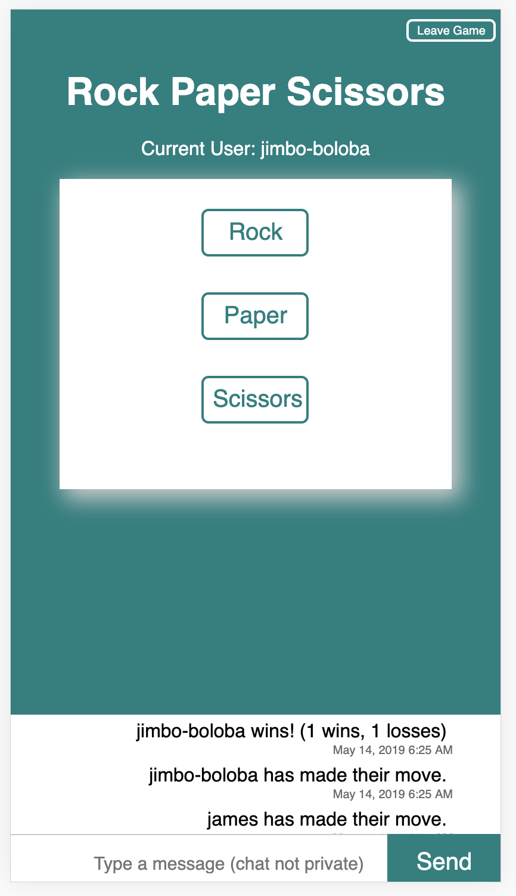

# Rock Paper Scissors
A realtime game that allows to players to compete head to head, while others can watch as spectators. The database component (required for the realtime functionality of the game) is Google Firebase

The game includes a chat feed, that allows players and spectators to interact with each other during play time. 

In order to play the game, you must be logged in. Login is persisted via storing the username in local storage, as well as in Firebase. 

After logging in, the user will see a modal with options to play or watch the game. Different messages will show above the buttons depending on whether there is already an opponent signed up. If a game is already in session, the game feed is shown to the user so they can see how the game progresses.

When two players have chosen to play the game, the active players in the game will see three buttons for rock, paper, scissors. When a player makes a choice, the buttons are hidden from that player - committing them to their choice. Once the other player chooses, the results of that round are logged to the feed, and the buttons are shown to the active players. The players can continuing playing until one of them clicks 'leave game'.

When a player clicks 'leave game', the game ends for all players and spectators. Spectators do not see the 'leave game' button.

Score keeping - The wins/losses logged to the feed are based on the totals for a given user. 
